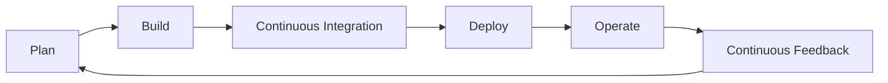
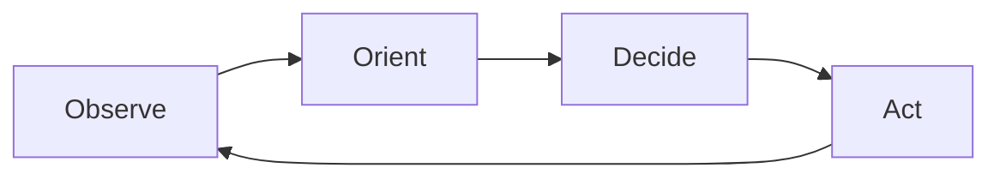
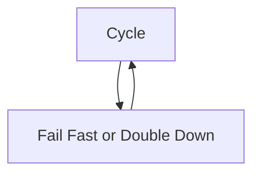
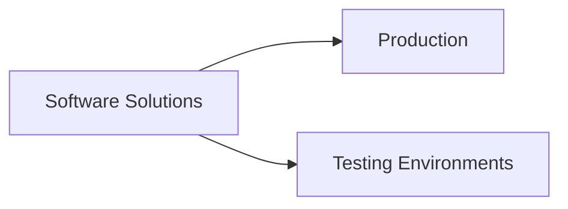
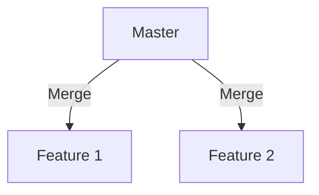
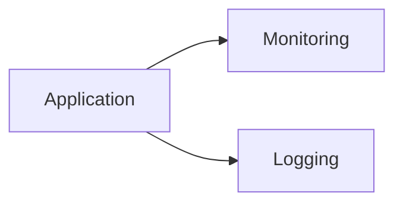
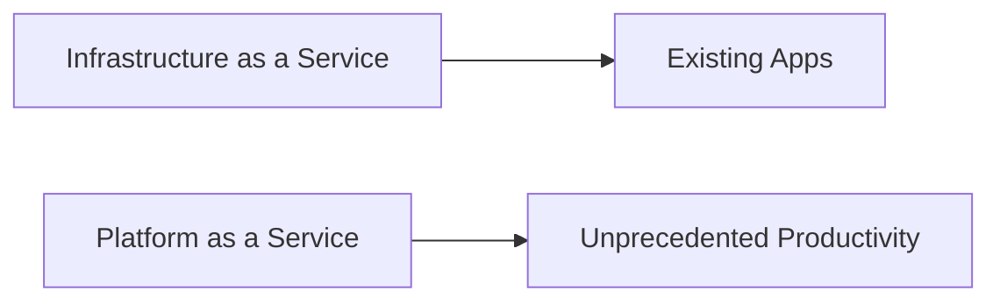
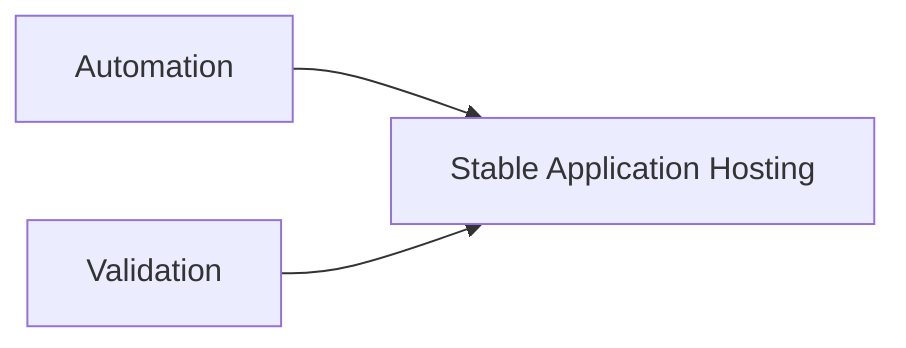

### Introduction to DevOps

**Definition**:  
"DevOps is the union of people, process, and products to enable continuous delivery of value to our end users." - Donovan Brown

### What You'll Learn in the DevOps Learning Paths:
- **Planning for DevOps**
- **Source Control Usage**
- **Scaling Git for Enterprise**
- **Combining Artifacts**
- **Designing Dependency Management**
- **Secret Management**
- **Continuous Integration**
- **Container-Build Strategy**
- **Release Strategy**
- **Release Management Workflow**
- **Deployment Patterns**
- **Feedback Mechanism Optimization**

#### Planning for DevOps:
Planning is crucial before implementing DevOps. This module introduces you to:
- The DevOps philosophy
- How to plan for a DevOps transformation

### DevOps Transformation Journey
- **Description**: 8 learning paths introducing Azure DevOps, GitHub, and related integrations.

### Why Take the DevOps Learning Path?
- **Target Audience**: Professionals aiming to design and implement DevOps processes, especially those preparing for the **AZ-400 - Designing and Implementing Microsoft DevOps Solutions** certification.

#### Certification Details:
- **Exam AZ-400**: 
  - **Focus**: Combining people, processes, and technologies for continuous delivery of valuable products.
  - **Skills Required**: 
    - Proficiency in Agile practices
    - Knowledge in Azure administration and development
    - Expertise in:
      - Version control
      - Compliance
      - Infrastructure as code
      - Configuration management
      - Build, release, and testing with Azure technologies

**Domain Areas and Weights**:
```markdown
| AZ-400 Domain Area                   | Weight |
|--------------------------------------|--------|
| Design and implement processes and communications. | 11%    |
| Design and implement a source control strategy.    | 13%    |
| Design and implement build and release pipelines.  | 51%    |
| Develop a security and compliance plan.            | 16%    |
| Implement an instrumentation strategy.             | 9%     |
```

This structured format should help you revise the key points efficiently. Remember, if you need to delve into any specific area like implementing CI/CD pipelines with Azure DevOps, here's a basic example:

```yaml
trigger:
- main

pool:
  vmImage: 'ubuntu-latest'

variables:
  buildConfiguration: 'Release'

steps:
- script: dotnet build --configuration $(buildConfiguration)
  displayName: 'dotnet build $(buildConfiguration)'

- task: DotNetCoreCLI@2
  inputs:
    command: 'test'
    projects: '**/*Tests/*.csproj'
    arguments: '--configuration $(buildConfiguration)'
```

This script block shows a simple CI configuration in Azure Pipelines for a .NET Core application.

### DevOps Overview
**DevOps** is about breaking down the silos between Development and Operations to foster a culture of collaboration and efficiency through shared practices and tools. 

**Essential DevOps Practices**:
- **Agile Planning**
- **Continuous Integration** (CI)
- **Continuous Delivery** (CD)
- **Monitoring of Applications**

**DevOps Journey**: Continuous improvement and adaptation.

### Collaboration in DevOps Cycle


### Understanding Cycle Time

**OODA Loop in Software Development**:

1. **Observe**: Analyze business, market, user behavior, telemetry.
2. **Orient**: Evaluate options, possibly through experiments.
3. **Decide**: Choose what to pursue.
4. **Act**: Deliver software to users.



### Data-Informed Decisions

- Use data to guide your next steps.
- **Outcomes of Deployments**:
  - 1/3 negative business results
  - 1/3 positive results
  - 1/3 no difference

### Strive for Validated Learning

- **Cycle Time**: Determines speed of feedback and learning.
- **Validated Learning**: Gathering factual, actionable data.



### Shortening Cycle Time in DevOps

- Work in **smaller batches**
- Increase **automation**
- Harden **release pipelines**
- Improve **telemetry**
- **Frequent deployments**


### Optimizing Validated Learning

- **More frequent deployments** lead to more experiments.
- **Pivot or Persevere**: Make informed decisions faster.
- **Value of Improvement**: Sum of progress achieved and failures avoided.


These notes aim to provide a clear understanding of how DevOps practices can enhance the development process through cycle time reduction and data-driven decision-making. Remember, each loop in this process is an opportunity to learn and improve, making the entire development journey iterative and responsive to real-world feedback.

### DevOps Journey

**Objective**: Shorten cycle time.

- **Release Pipeline**: Measure the time from code change to deployment. This duration is your velocity brake.

#### Continuous Integration (CI)


- **Benefits**:
  - Early detection of defects.
  - Less time on merge conflicts.
  - Quick feedback to developers.

#### Continuous Delivery (CD)



- **Advantages**:
  - Swift bug fixes.
  - Rapid response to business changes.

#### Version Control Systems



- **Git-based Repositories** for global team collaboration and integration with development tools.

#### Agile and Lean Project Management

- **Sprints**: Isolate work for better management.
- **Team Capacity**: Adapt quickly to business changes.

**Definition of Done**: Software that's deployed, collecting telemetry, meeting business goals.


#### Monitoring and Logging

- **Purpose**: Validate or disprove hypotheses with real-time data.
- **Technology**: Various formats for capturing and storing rich data.



#### Cloud Computing

- **Public and Hybrid Clouds**: Eliminates traditional infrastructure bottlenecks.



#### Infrastructure as Code (IaC)



- **Benefits**: Automates environment setup and teardown for consistency and security.

#### Microservices Architecture


- **Advantages**: Scalability, efficiency through isolated business use cases.

#### Containers


- **Comparison**: More lightweight, faster setup, and easier configuration than VMs.

### DevOps Adoption

- **Initial Pain**: Like starting a new fitness regime, expect some discomfort.
- **Practice**: The more you practice, the easier the process becomes.
- **Strategy**: Start with significant impact practices, then cross-train for synergy.

Remember, adopting DevOps is akin to embarking on a fitness journey; it might be tough at the start, but with practice, it leads to efficiency and agility in software development.

### Identifying Transformation Teams for DevOps

**Challenges in DevOps Transformation:**

- **Staff Availability**: Staff leading transformation projects are often also responsible for daily operations, which can detract from their focus on transformation due to:
  - **Customer Priorities**: Urgent customer issues take precedence over long-term projects like DevOps transformation.

- **Organizational Operations**: Existing business processes designed for current outcomes can resist the changes needed for DevOps.

**Approach to Overcome Challenges:**

- **Separate Transformation Team**:
  - **Purpose**: To manage and execute the DevOps transformation without the distractions of daily operations.
  - **Composition**: 
    - **Internal Staff**: Employees focused on transformation outcomes rather than day-to-day work. 
      - **Criteria**: Should be well-regarded, offering diverse knowledge to innovate.
    - **External Experts**: To supplement with knowledge and experience in DevOps practices not yet mastered by the team.

**Reference**:

- **Book**: *"Beyond the Idea: How to Execute Innovation"* by Dr. Vijay Govindarajan and Dr. Chris Trimble
  - **Key Insight**: Successful innovation often requires working around existing organizational structures by establishing a dedicated team.

**Benefits of a Dedicated Team:**

- **Focus**: Ensures the transformation project gets undivided attention.
- **Expertise**: Combines internal knowledge with external insights, accelerating learning and implementation.
- **Innovation**: A diverse, respected team can challenge and rethink existing practices more effectively.

**Implementation Strategy:**

1. **Form the Team**: Select team members based on their ability to innovate and their reputation within the organization.
2. **Set Clear Goals**: Measure the team's success by transformation milestones, not operational metrics.
3. **Engage External Help**: Bring in consultants or experts in DevOps to bridge knowledge gaps.

This approach helps in navigating the complexities of changing operational culture and practices while ensuring that the transformation project remains on track.